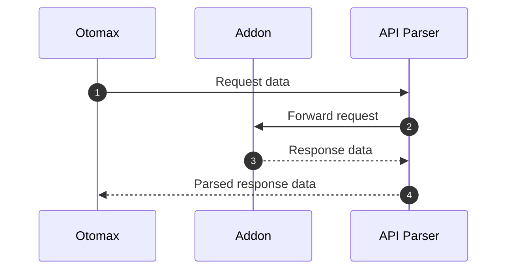
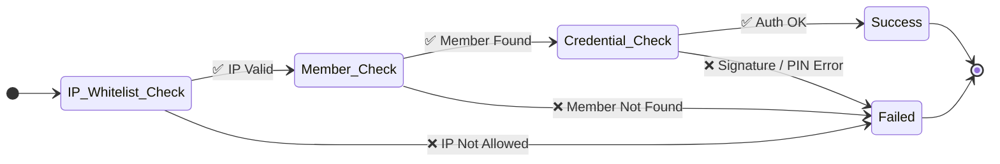

# Project API Parser

Project ini adalah sebauh localhost yg akan menjembatani antara Otomax (Requester) dengan Addon Yang du develop otoplus :
    - digipos : adddon telkomsel
    - isimple : adddon indosat
    - sidompul : addon XL
    - Rita : addon tri
    - dan addon addon lain nya

## Features

- memparse ulang respon dari addon yang panjang , menjadi simple string ke otomax
- menampilkan UI dengan streamlit untuk terkoneksi ke adddon (seperti get account dan lain lain)
- dan feature lainnya

## Flow

berikut diagram use case dari project ini:

## Tech Stack

- UV : sebagai pengganti pip untuk management project.
- Python >= 3.12 : versi python yang digunakan.
- FastAPI : untuk membuat API yang cepat dan efisien.
- Loguru : untuk logging yang lebih baik.

## sementara NO FrontEND dulu , ngga ada Crud by UI

## validation chain

